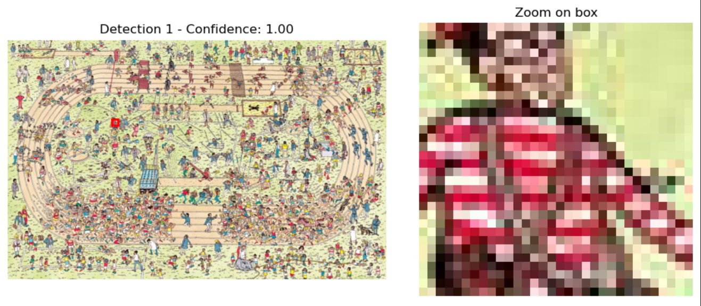
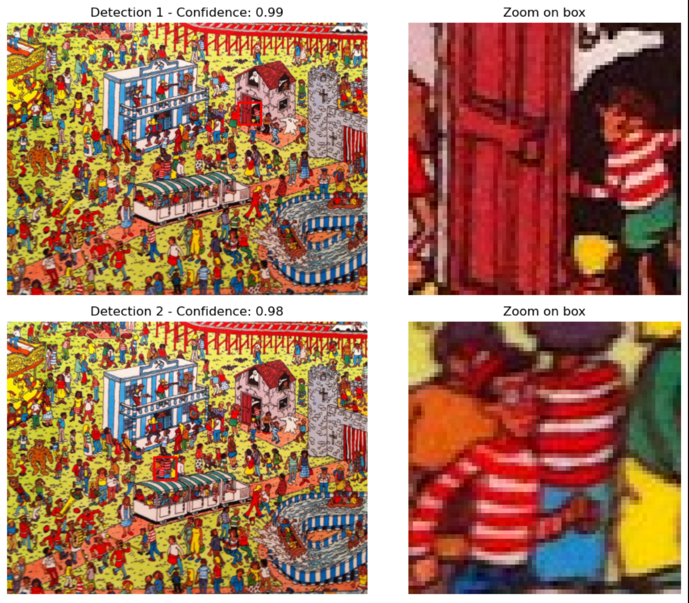
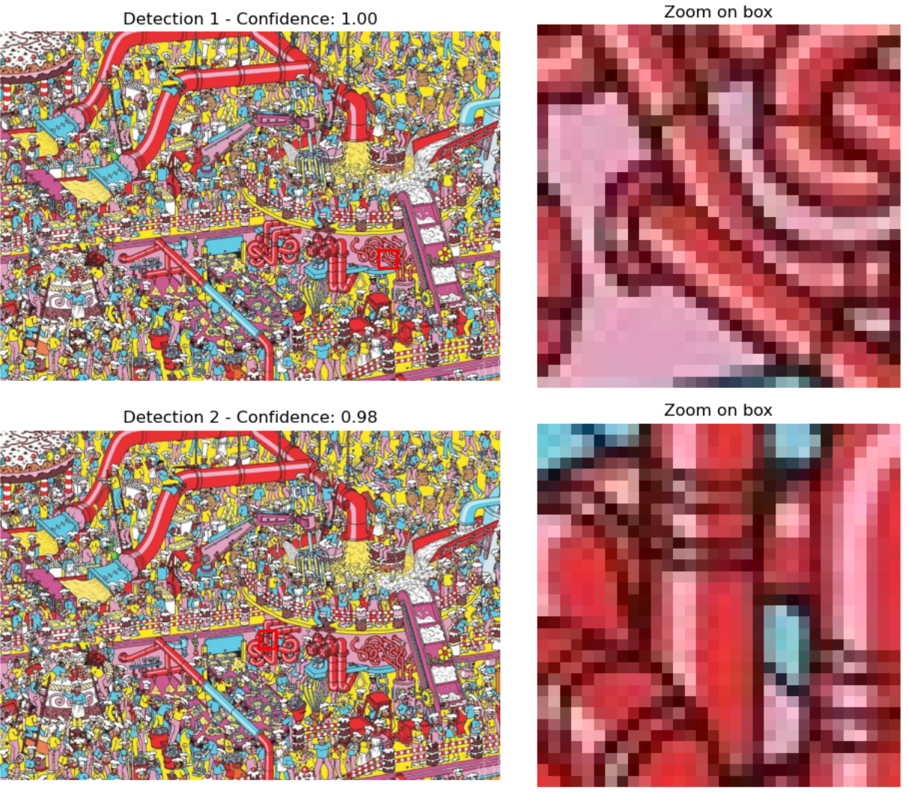

# Sliding Window Detection Strategy

## Detection Pipeline Overview

To locate Waldo in full-resolution images, we implemented a **sliding window detection pipeline** enhanced with a **scale pyramid**, **red color filtering**, and **Non-Maximum Suppression (NMS)**. This combination provides a scalable and efficient method for locating Waldo while remaining consistent with the model’s training distribution.

---

## Sliding Window with Scale Pyramid

The detector systematically scans the original image using a fixed-size window that moves horizontally and vertically across the entire area.

- The **base window size** is `64×64`, matching the patch size used during model training.
- To detect Waldos of varying apparent sizes, we apply a **scale pyramid**: the window size is scaled (e.g., `64`, `32`, `43` pixels), while the image itself remains unchanged.

> ⚠️ **Why scale the window and not the image?**  
> Resizing the full image alters its visual structure (e.g., texture, edge sharpness, proportions), potentially confusing the model. Scaling only the window keeps the image intact while allowing multi-scale detection.

---

## Red Color Filtering

To reduce computational overhead and improve efficiency, we include a **red color-based filter**:

- Before inference, each patch is evaluated for **red color dominance**, using adjustable parameters (`red_threshold`, `red_factor`).
- Patches that do not meet the red threshold—typically areas without visual resemblance to Waldo’s outfit—are skipped.

This filter leverages domain-specific knowledge to discard uninformative regions while preserving recall in likely areas.

---

## Non-Maximum Suppression (NMS)

Since overlapping windows are processed at multiple scales, multiple detections may cluster around the same object. To reduce redundancy:

- We apply **Non-Maximum Suppression (NMS)** with a configurable **IoU threshold** (e.g., `0.1`), keeping only the highest-scoring box within overlapping regions.

This step ensures that final detections are clean and localized, improving interpretability and post-processing.

---

## Summary of Components

| Component              | Purpose                                                                 |
|------------------------|-------------------------------------------------------------------------|
| **Sliding Window**     | Systematically scan full-resolution images using fixed-size windows     |
| **Scale Pyramid**      | Adjust window size to detect Waldos appearing at different scales       |
| **Red Filter**         | Skip low-red-content patches to reduce inference time and false positives |
| **NMS**                | Eliminate overlapping detections, keeping only the strongest candidates  |

---

## Detection Examples

Below are several examples of Waldo detection using the full pipeline:

### ✅ Successful Detection – Top-Ranked Box

In the following example, Waldo is correctly detected in the **top-ranked** bounding box, with a confidence score above 0.95. 

---

### ✅ Successful Detection – Lower-Ranked Box

Here, Waldo is detected in the **second-ranked** prediction. 

---

### ❌ Missed Detection

Here, Waldo was detected in the **fifth-ranked** position, which resulted in a failure.

# ✅ Validation Results

## 5.2. Summary of Sliding Window Validation

| Image ID  | Detection | Notes                                                       |
|-----------|-----------|-------------------------------------------------------------|
| image1    | ✅         | —                                                           |
| image2    | ✅         | —                                                           |
| image3    | ✅         | —                                                           |
| image4    | ✅         | —                                                           |
| image5    | ✅         | —                                                           |
| image6    | ✅         | —                                                           |
| image7    | ✅         | —                                                           |
| image8    | ✅         | —                                                           |
| image9    | ❌         | Waldo not detected                                          |
| image10   | ✅         | Red threshold adjusted manually                             |
| image11   | ✅         | —                                                           |
| image12   | ✅         | Red threshold adjusted manually                             |
| image13   | ✅         | —                                                           |
| image14   | ✅         | —                                                           |
| image15   | ❌         | Detected at the 15th position in ranked sliding windows     |

---

## 📈 Detection Performance Overview

- 🟢 **Successful detections**: **13 / 15 images**
- 🔴 **Missed detections**: `image9`, `image15`
- ⚙️ **Manual red filter adjustments applied**: `image10`, `image12`

## Evaluation Results and Discussion

Waldo was successfully detected in **86.7%** of the test cases.

This result highlights not only the effectiveness of the sliding window approach combined with tuned parameters, but also the **robustness and consistency** of the model across different images.

However, it is important to note that the validation set is relatively small, which limits our ability to confidently generalize this success rate to a broader, more diverse dataset.

The only two images where Waldo was not detected (`image9` and `image15`) are visually complex and contain numerous distracting patterns that closely resemble Waldo’s outfit. This makes detection especially challenging—even for a human observer—and reveals the limitations of the current **patch-based detection** strategy.

### Missed Cases

- **`image9`**: Waldo was not detected, likely due to one or more of the following reasons:
  1. The NMS algorithm prioritized overlapping predictions with slightly lower confidence, suppressing the true positive.
  2. The stride may have been too large to properly cover the small region where Waldo’s head appears.

- **`image15`**: Although the model **correctly detected Waldo in its patch**, the final ranking placed **14 false positives** above it. These false positives scored higher, leading to a missed detection in the final output.

### Future Directions

To improve detection accuracy and efficiency, a promising direction would be to integrate an **object detection model** to first propose candidate regions before applying the classifier. This could drastically reduce the number of sliding window evaluations needed.

That said, *Where’s Waldo?* illustrations contain a **high density of small, visually similar elements**, which may cause traditional region proposal networks to underperform. Significant adaptation would be required to make such models effective in this highly specialized visual domain.

Another promising line of improvement would be to explore **attention-based mechanisms**, which could allow the model to focus more on **where** Waldo might be located in the image, rather than strictly on **how** Waldo looks in isolated patches.

Unlike sliding window approaches that exhaustively scan the image with fixed-size windows, attention algorithms can dynamically prioritize **regions of interest** based on contextual cues, visual saliency, or learned spatial patterns. This paradigm shift could enable the model to process the image more holistically, considering both local features and global layout when estimating the most likely locations of Waldo.

By incorporating transformer-based architectures or visual attention modules, the system could learn to highlight regions that are more likely to contain human figures or clothing patterns similar to Waldo’s, without needing to evaluate every possible patch. This would not only reduce the computational cost but also help the model **disambiguate complex backgrounds** filled with distractors that resemble Waldo.

Such techniques could complement or even replace the current exhaustive patch classification, offering a more **intelligent and efficient** approach to detection, particularly in high-resolution images with dense visual information like *Where’s Waldo?* scenes.

