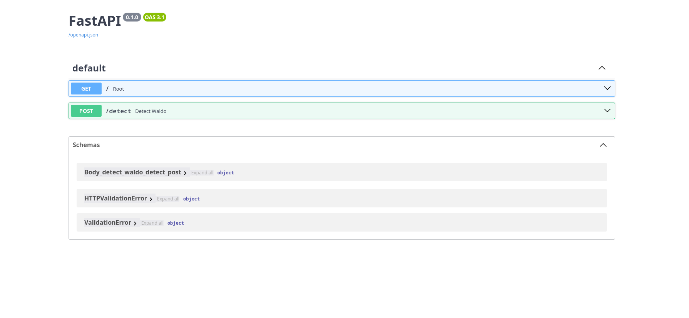
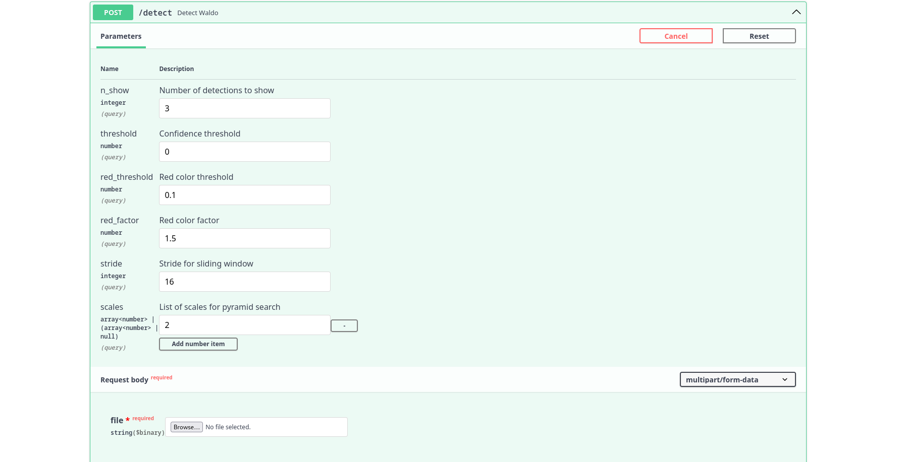
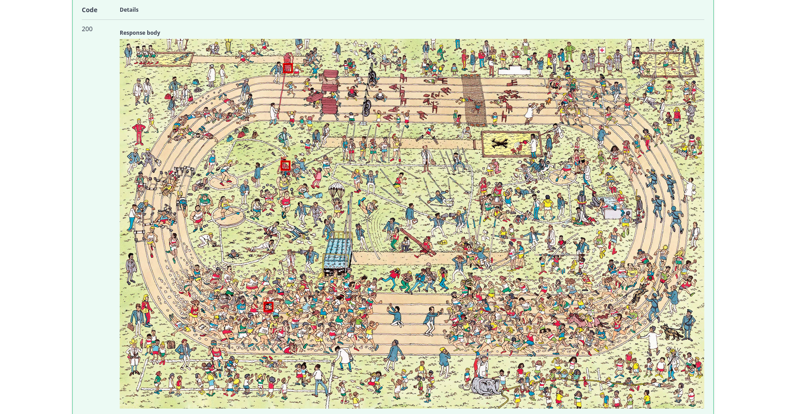

# Generate the API_USAGE.md file

content = """# 📡 API Usage – Waldo Detector

This API provides an endpoint to run Waldo detection on full-sized images using a sliding window with multiscale support. It returns the predicted bounding boxes for Waldo instances found in the image.

---

## 🚀 How to Launch the API

You must have the environment set up (see `requirements.txt`) and launch the API with FastAPI using Uvicorn:

```bash
uvicorn api:app --reload
```


By default, the API will be available at:

http://127.0.0.1:8000

To view the automatic API docs (Swagger):

http://127.0.0.1:8000/docs

## 📥 Endpoint: `/detect`
**Method:** `POST`  
**Content-Type:** `multipart/form-data`  
**Description:** Detect Waldo in uploaded images using a trained CNN model with sliding window technique and scale pyramid.

---

## 🧾 Parameters
| Parameter       | Type         | Required | Default      | Description |
|-----------------|--------------|----------|--------------|-------------|
| `image`         | File         | ✅       | –            | Input image (PNG/JPG/JPEG) |
| `stride`        | int          | ❌       | 16           | Pixel step between sliding windows |
| `scales`        | list[float]  | ❌       | [1.0]        | Scale factors for pyramid (e.g. [0.5, 1.0, 1.5]) |
| `iou_threshold` | float        | ❌       | 0.0          | IoU threshold for NMS box merging |
| `red_threshold` | float        | ❌       | 0.1          | Minimum red intensity for candidate filtering |
| `red_factor`    | float        | ❌       | 1.5          | Red channel amplification factor |

---

## 📤 Example Requests


### 🌐 Web Interface

The API also includes a user-friendly **web interface** powered by **Swagger UI**, which allows you to test the detection system without writing any code.

To access it, simply start the server and visit:

http://127.0.0.1:8000/docs
From this interface, you can:

- Upload an image
- Adjust detection parameters (e.g., stride, scale, thresholds)
- Send the request and preview the returned image with bounding boxes
- Inspect the returned metadata

This is useful for both debugging and demonstrating the system to non-technical users.

#### 🖼️ Example 1 – Upload Section





Here you can drag and drop or select a file, and change any optional parameter directly in the form.

#### 🖼️ Example 2 – Response Preview



The response displays the detection result as an image, and the interface allows you to download it or inspect the raw JSON data (bounding boxes and scores).


### 📤 CURL
```bash
curl -X POST "http://127.0.0.1:8000/detect" \
  -F "file=@example.jpg" \
  -F "stride=16" \
  -F "scales=[0.5,1.0,1.5]" \
  -F "red_threshold=0.0"
  -F "red_factor=0.0"
  -F "threshold=0.0"

